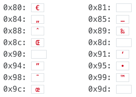

# Tools
                
These are just some of my cool tools (also, don't forget to check out <a href="https://codepen.io/mattborja" rel="nofollow">the pen</a>)...

                <h3>A Password Generator</h3>
                
The following hand-formatted one-liner (i.e. minified) script uses the <a href="https://developer.mozilla.org/en-US/docs/Web/API/Web_Crypto_API" rel="nofollow">Web Crypto API</a> to generate an <em>epic password</em>: <strong>8,192 bytes</strong> (yes, characters) of <em>cryptographically strong</em> random values; locally, right inside your web browser with no information sent over the network. It is then hashed using SHA256 as a multipurpose function for:

                <ul>
                    <li>hex-encoding the raw binary data,</li>
                    <li>reducing its size to a more realistic 64 bytes,</li>
                    <li>while maintaining its cryptographic strength using its <a href="https://en.wikipedia.org/wiki/SHA-2" rel="nofollow">SHA-2 cryptographic properties</a>.</li>
                </ul>
                

                    

                        <pre class="m-0">(function (csrngSize=8192) {
  return window.crypto.subtle.digest('SHA-256', window.crypto.getRandomValues(new Uint8Array(csrngSize)))
   .then(function(buf) {
      return Array.prototype.map.call(new Uint8Array (buf) , function(x) { return ('00'+x).toString(16).slice(-2); })
              .join('');
  })
  .then(hash => alert('Here you go: ' + hash));
})();</pre>
                    

                    
<button class="btn btn-sm btn-dark" onclick="javascript:(function(csrngSize=8192){return window.crypto.subtle.digest('SHA-256',window.crypto.getRandomValues(new Uint8Array(csrngSize))).then(buf=>Array.prototype.map.call(new Uint8Array(buf),x=>(('00'+x.toString(16)).slice(-2))).join('')).then(hash=>alert('Here you go: ' + hash))})();">Try It!</button>

                

                
<a href="https://www.security.org/how-secure-is-my-password/" rel="nofollow">Some say a password of this stature</a> could take a computer as much as 3 <em>sesvigintillion</em>-ish years to crack. Though, I haven't exactly had a chance to verify that theory to date (and I'm not sure I'd want to, to be honest).

                <h3 title="Yes, these values and descriptions were either generated or typed out all by hand...">ASCII Table</h3>
                
ASCII values ordered from left-to-right, top-to-bottom.

                <h4>Input</h4>
                
Hover over <code class="border px-2" title="Description will appear here (and perhaps more)">CODE</code> for description.

                

                    
0x00: <code class="border px-2" title="Null (null way, d00d! ya brah!)">NUL</code>

                    
0x01: <code class="border px-2" title="Start of heading">SOH</code>

                    
0x02: <code class="border px-2" title="Start of text">STX</code>

                    
0x03: <code class="border px-2" title="End of text">ETX</code>

                    
0x04: <code class="border px-2" title="End of transmission">EOT</code>

                    
0x05: <code class="border px-2" title="Enquiry">ENQ</code>

                    
0x06: <code class="border px-2" title="Acknowledgment">ACK</code>

                    
0x07: <code class="border px-2" title="Bell (ding!)">BEL</code>

                    
0x08: <code class="border px-2" title="Backspace (seriously)">BS</code>

                    
0x09: <code class="border px-2" title="Horizontal tab">HT</code>

                    
0x0a: <code class="border px-2" title="Line feed">LF</code>

                    
0x0b: <code class="border px-2" title="Vertical tab (I've never actually tried to use one of these, but it sounds interesting...)">VT</code>

                    
0x0c: <code class="border px-2" title="Form feed">FF</code>

                    
0x0d: <code class="border px-2" title="Carriage return">CR</code>

                    
0x0e: <code class="border px-2" title="Shift out (not StackOverflow)">SO</code>

                    
0x0f: <code class="border px-2" title="Shift in">SI</code>

                    
0x10: <code class="border px-2" title="Data link escape (Is your refridgerator running? Then you better...nevermind.">DLE</code>

                    
0x11: <code class="border px-2" title="Device control 1">DC1</code>

                    
0x12: <code class="border px-2" title="Device control 2">DC2</code>

                    
0x13: <code class="border px-2" title="Device control 3">DC3</code>

                    
0x14: <code class="border px-2" title="Device control 4">DC4</code>

                    
0x15: <code class="border px-2" title="Negative acknowledgment (...paddy-wack, give a dog a bone...)">NAK</code>

                    
0x16: <code class="border px-2" title="Synchronous idle">SYN</code>

                    
0x17: <code class="border px-2" title="End transmission block (time to get another one)">ETB</code>

                    
0x18: <code class="border px-2" title="Cancel (I think anything else would've been more intuitive)">CAN</code>

                    
0x19: <code class="border px-2" title="End of medium (I mean, it was an okay blog platform while it lasted)">EM</code>

                    
0x1a: <code class="border px-2" title="Substitute (this doesn't actually exist...)">SUB</code>

                    
0x1b: <code class="border px-2" title="Escape (DLE, Part Deux)">ESC</code>

                    
0x1c: <code class="border px-2" title="File separator (not file system)">FS</code>

                    
0x1d: <code class="border px-2" title="Group separator (not game server instance)">GS</code>

                    
0x1e: <code class="border px-2" title="Record separator (not RuneScape; more like CRLF on steroids)">RS</code>

                    
0x1f: <code class="border px-2" title="Unit separator (like 0x2c on steroids; also sounds interesting)">US</code>

                

                <h4>Output</h4>
                

                    
0x20: <code class="border px-2" title="Space">SPC</code>

                    
0x21: <code class="border px-2">&#x21;</code>

                    
0x22: <code class="border px-2">&#x22;</code>

                    
0x23: <code class="border px-2">&#x23;</code>

                    
0x24: <code class="border px-2">&#x24;</code>

                    
0x25: <code class="border px-2">&#x25;</code>

                    
0x26: <code class="border px-2">&#x26;</code>

                    
0x27: <code class="border px-2">&#x27;</code>

                    
0x28: <code class="border px-2">&#x28;</code>

                    
0x29: <code class="border px-2">&#x29;</code>

                    
0x2a: <code class="border px-2">&#x2a;</code>

                    
0x2b: <code class="border px-2">&#x2b;</code>

                    
0x2c: <code class="border px-2">&#x2c;</code>

                    
0x2d: <code class="border px-2">&#x2d;</code>

                    
0x2e: <code class="border px-2">&#x2e;</code>

                    
0x2f: <code class="border px-2">&#x2f;</code>

                    
0x30: <code class="border px-2">&#x30;</code>

                    
0x31: <code class="border px-2">&#x31;</code>

                    
0x32: <code class="border px-2">&#x32;</code>

                    
0x33: <code class="border px-2">&#x33;</code>

                    
0x34: <code class="border px-2">&#x34;</code>

                    
0x35: <code class="border px-2">&#x35;</code>

                    
0x36: <code class="border px-2">&#x36;</code>

                    
0x37: <code class="border px-2">&#x37;</code>

                    
0x38: <code class="border px-2">&#x38;</code>

                    
0x39: <code class="border px-2">&#x39;</code>

                    
0x3a: <code class="border px-2">&#x3a;</code>

                    
0x3b: <code class="border px-2">&#x3b;</code>

                    
0x3c: <code class="border px-2">&#x3c;</code>

                    
0x3d: <code class="border px-2">&#x3d;</code>

                    
0x3e: <code class="border px-2">&#x3e;</code>

                    
0x3f: <code class="border px-2">&#x3f;</code>

                    
0x40: <code class="border px-2">&#x40;</code>

                    
0x41: <code class="border px-2">&#x41;</code>

                    
0x42: <code class="border px-2">&#x42;</code>

                    
0x43: <code class="border px-2">&#x43;</code>

                    
0x44: <code class="border px-2">&#x44;</code>

                    
0x45: <code class="border px-2">&#x45;</code>

                    
0x46: <code class="border px-2">&#x46;</code>

                    
0x47: <code class="border px-2">&#x47;</code>

                    
0x48: <code class="border px-2">&#x48;</code>

                    
0x49: <code class="border px-2">&#x49;</code>

                    
0x4a: <code class="border px-2">&#x4a;</code>

                    
0x4b: <code class="border px-2">&#x4b;</code>

                    
0x4c: <code class="border px-2">&#x4c;</code>

                    
0x4d: <code class="border px-2">&#x4d;</code>

                    
0x4e: <code class="border px-2">&#x4e;</code>

                    
0x4f: <code class="border px-2">&#x4f;</code>

                    
0x50: <code class="border px-2">&#x50;</code>

                    
0x51: <code class="border px-2">&#x51;</code>

                    
0x52: <code class="border px-2">&#x52;</code>

                    
0x53: <code class="border px-2">&#x53;</code>

                    
0x54: <code class="border px-2">&#x54;</code>

                    
0x55: <code class="border px-2">&#x55;</code>

                    
0x56: <code class="border px-2">&#x56;</code>

                    
0x57: <code class="border px-2">&#x57;</code>

                    
0x58: <code class="border px-2">&#x58;</code>

                    
0x59: <code class="border px-2">&#x59;</code>

                    
0x5a: <code class="border px-2">&#x5a;</code>

                    
0x5b: <code class="border px-2">&#x5b;</code>

                    
0x5c: <code class="border px-2">&#x5c;</code>

                    
0x5d: <code class="border px-2">&#x5d;</code>

                    
0x5e: <code class="border px-2">&#x5e;</code>

                    
0x5f: <code class="border px-2">&#x5f;</code>

                    
0x60: <code class="border px-2">&#x60;</code>

                    
0x61: <code class="border px-2">&#x61;</code>

                    
0x62: <code class="border px-2">&#x62;</code>

                    
0x63: <code class="border px-2">&#x63;</code>

                    
0x64: <code class="border px-2">&#x64;</code>

                    
0x65: <code class="border px-2">&#x65;</code>

                    
0x66: <code class="border px-2">&#x66;</code>

                    
0x67: <code class="border px-2">&#x67;</code>

                    
0x68: <code class="border px-2">&#x68;</code>

                    
0x69: <code class="border px-2">&#x69;</code>

                    
0x6a: <code class="border px-2">&#x6a;</code>

                    
0x6b: <code class="border px-2">&#x6b;</code>

                    
0x6c: <code class="border px-2">&#x6c;</code>

                    
0x6d: <code class="border px-2">&#x6d;</code>

                    
0x6e: <code class="border px-2">&#x6e;</code>

                    
0x6f: <code class="border px-2">&#x6f;</code>

                    
0x70: <code class="border px-2">&#x70;</code>

                    
0x71: <code class="border px-2">&#x71;</code>

                    
0x72: <code class="border px-2">&#x72;</code>

                    
0x73: <code class="border px-2">&#x73;</code>

                    
0x74: <code class="border px-2">&#x74;</code>

                    
0x75: <code class="border px-2">&#x75;</code>

                    
0x76: <code class="border px-2">&#x76;</code>

                    
0x77: <code class="border px-2">&#x77;</code>

                    
0x78: <code class="border px-2">&#x78;</code>

                    
0x79: <code class="border px-2">&#x79;</code>

                    
0x7a: <code class="border px-2">&#x7a;</code>

                    
0x7b: <code class="border px-2">&#x7b;</code>

                    
0x7c: <code class="border px-2">&#x7c;</code>

                    
0x7d: <code class="border px-2">&#x7d;</code>

                    
0x7e: <code class="border px-2">&#x7e;</code>

                    
0x7f: <code class="border px-2" title="Delete">DEL</code>

                

                <h4>Control Characters</h4>
                
Note: Control Characters are <a href="https://stackoverflow.com/a/5380136" rel="nofollow">disallowed by spec</a> and forbidden by W3C's validator and have thus been replaced by their image snapshot renditions below.

                

                    

                        
                    

                    

                        
                    

                

                <h4>Misc Characters†</h4>
                

                    
0xa0: <code class="border px-2">&#xa0;</code>

                    
0xa1: <code class="border px-2">&#xa1;</code>

                    
0xa2: <code class="border px-2">&#xa2;</code>

                    
0xa3: <code class="border px-2">&#xa3;</code>

                    
0xa4: <code class="border px-2">&#xa4;</code>

                    
0xa5: <code class="border px-2">&#xa5;</code>

                    
0xa6: <code class="border px-2">&#xa6;</code>

                    
0xa7: <code class="border px-2">&#xa7;</code>

                    
0xa8: <code class="border px-2">&#xa8;</code>

                    
0xa9: <code class="border px-2" title="Copyright">&#xa9;</code>

                    
0xaa: <code class="border px-2">&#xaa;</code>

                    
0xab: <code class="border px-2">&#xab;</code>

                    
0xac: <code class="border px-2">&#xac;</code>

                    
0xad: <code class="border px-2">&#xad;</code>

                    
0xae: <code class="border px-2" title="Registered trademark">&#xae;</code>

                    
0xaf: <code class="border px-2">&#xaf;</code>

                    
0xb0: <code class="border px-2" title="Degree symbol">&#xb0;</code>

                    
0xb1: <code class="border px-2">&#xb1;</code>

                    
0xb2: <code class="border px-2">&#xb2;</code>

                    
0xb3: <code class="border px-2">&#xb3;</code>

                    
0xb4: <code class="border px-2">&#xb4;</code>

                    
0xb5: <code class="border px-2">&#xb5;</code>

                    
0xb6: <code class="border px-2">&#xb6;</code>

                    
0xb7: <code class="border px-2">&#xb7;</code>

                    
0xb8: <code class="border px-2">&#xb8;</code>

                    
0xb9: <code class="border px-2">&#xb9;</code>

                    
0xba: <code class="border px-2">&#xba;</code>

                    
0xbb: <code class="border px-2">&#xbb;</code>

                    
0xbc: <code class="border px-2">&#xbc;</code>

                    
0xbd: <code class="border px-2">&#xbd;</code>

                    
0xbe: <code class="border px-2">&#xbe;</code>

                    
0xbf: <code class="border px-2">&#xbf;</code>

                    
0xc0: <code class="border px-2">&#xc0;</code>

                    
0xc1: <code class="border px-2">&#xc1;</code>

                    
0xc2: <code class="border px-2">&#xc2;</code>

                    
0xc3: <code class="border px-2">&#xc3;</code>

                    
0xc4: <code class="border px-2">&#xc4;</code>

                    
0xc5: <code class="border px-2">&#xc5;</code>

                    
0xc6: <code class="border px-2">&#xc6;</code>

                    
0xc7: <code class="border px-2">&#xc7;</code>

                    
0xc8: <code class="border px-2">&#xc8;</code>

                    
0xc9: <code class="border px-2">&#xc9;</code>

                    
0xca: <code class="border px-2">&#xca;</code>

                    
0xcb: <code class="border px-2">&#xcb;</code>

                    
0xcc: <code class="border px-2">&#xcc;</code>

                    
0xcd: <code class="border px-2">&#xcd;</code>

                    
0xce: <code class="border px-2">&#xce;</code>

                    
0xcf: <code class="border px-2">&#xcf;</code>

                    
0xd0: <code class="border px-2">&#xd0;</code>

                    
0xd1: <code class="border px-2">&#xd1;</code>

                    
0xd2: <code class="border px-2">&#xd2;</code>

                    
0xd3: <code class="border px-2">&#xd3;</code>

                    
0xd4: <code class="border px-2">&#xd4;</code>

                    
0xd5: <code class="border px-2">&#xd5;</code>

                    
0xd6: <code class="border px-2">&#xd6;</code>

                    
0xd7: <code class="border px-2">&#xd7;</code>

                    
0xd8: <code class="border px-2">&#xd8;</code>

                    
0xd9: <code class="border px-2">&#xd9;</code>

                    
0xda: <code class="border px-2">&#xda;</code>

                    
0xdb: <code class="border px-2">&#xdb;</code>

                    
0xdc: <code class="border px-2">&#xdc;</code>

                    
0xdd: <code class="border px-2">&#xdd;</code>

                    
0xde: <code class="border px-2">&#xde;</code>

                    
0xdf: <code class="border px-2">&#xdf;</code>

                    
0xe0: <code class="border px-2">&#xe0;</code>

                    
0xe1: <code class="border px-2">&#xe1;</code>

                    
0xe2: <code class="border px-2">&#xe2;</code>

                    
0xe3: <code class="border px-2">&#xe3;</code>

                    
0xe4: <code class="border px-2">&#xe4;</code>

                    
0xe5: <code class="border px-2">&#xe5;</code>

                    
0xe6: <code class="border px-2">&#xe6;</code>

                    
0xe7: <code class="border px-2">&#xe7;</code>

                    
0xe8: <code class="border px-2">&#xe8;</code>

                    
0xe9: <code class="border px-2">&#xe9;</code>

                    
0xea: <code class="border px-2">&#xea;</code>

                    
0xeb: <code class="border px-2">&#xeb;</code>

                    
0xec: <code class="border px-2">&#xec;</code>

                    
0xed: <code class="border px-2">&#xed;</code>

                    
0xee: <code class="border px-2">&#xee;</code>

                    
0xef: <code class="border px-2">&#xef;</code>

                    
0xf0: <code class="border px-2">&#xf0;</code>

                    
0xf1: <code class="border px-2">&#xf1;</code>

                    
0xf2: <code class="border px-2">&#xf2;</code>

                    
0xf3: <code class="border px-2">&#xf3;</code>

                    
0xf4: <code class="border px-2">&#xf4;</code>

                    
0xf5: <code class="border px-2">&#xf5;</code>

                    
0xf6: <code class="border px-2">&#xf6;</code>

                    
0xf7: <code class="border px-2">&#xf7;</code>

                    
0xf8: <code class="border px-2">&#xf8;</code>

                    
0xf9: <code class="border px-2">&#xf9;</code>

                    
0xfa: <code class="border px-2">&#xfa;</code>

                    
0xfb: <code class="border px-2">&#xfb;</code>

                    
0xfc: <code class="border px-2">&#xfc;</code>

                    
0xfd: <code class="border px-2">&#xfd;</code>

                    
0xfe: <code class="border px-2">&#xfe;</code>

                    
0xff: <code class="border px-2">&#xff;</code>

                

                
†Haven't spent a lot of time with these, except for maybe a handful. If you would like to contribute descriptions, feel free to <a href="https://github.com/mattborja/mattborja.dev/pulls" rel="nofollow">submit a new Pull Request</a> and be sure to reference <a href="https://github.com/mattborja/mattborja.dev/issues/2" rel="nofollow">Issue#2</a>!
